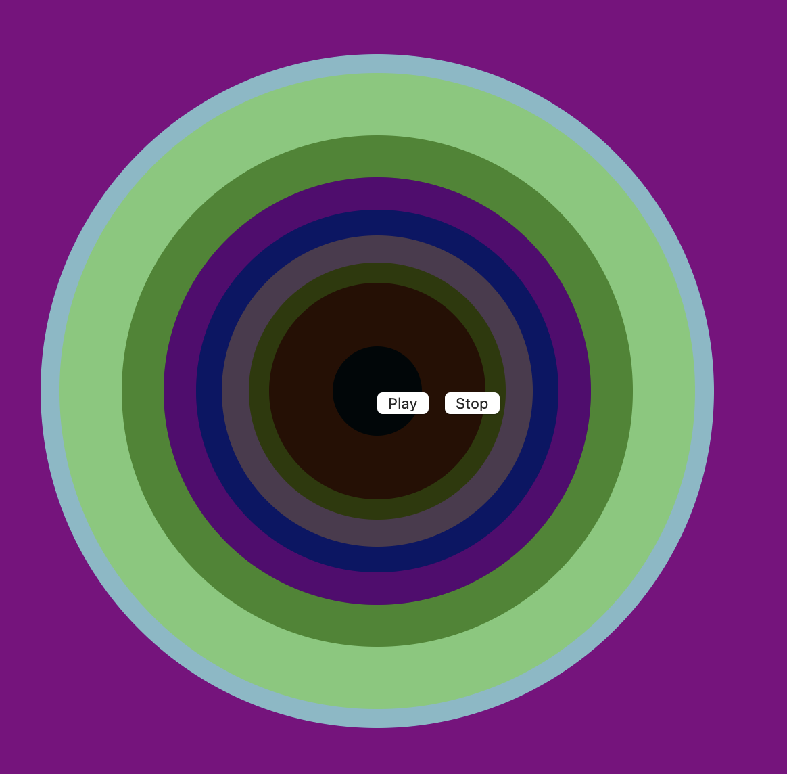
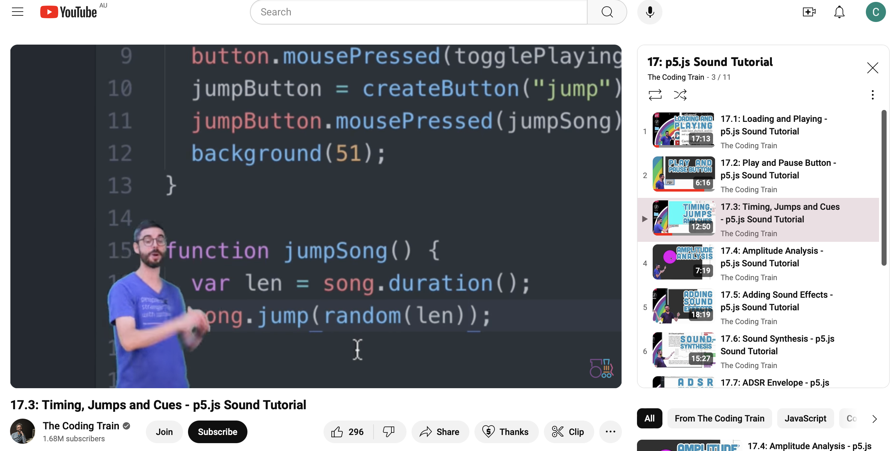

# Major Project

### Part 1: Instructions On How To Interact With The Work
<!-- #### Header 4
##### Header 5
###### Header 6 -->

<!-- **Bold Text** or __Bold Text__ -->
<!-- *Italic Text* or _Italic Text_ -->

- Clicking the Play/Pause button with the mouse will play the music, and the content of the screen will change with the rhythm of the music. Clicking the Play/Pause button with the mouse again will pause the animation, and when the button is clicked for the third time, the content of the screen will continue to play where it was last paused. The animation and music will loop as long as it is not paused.
  <div align=centre> 

### Part 2: Personal Approach
- I choose to drive my personalized code based on audio. My animated image properties include synchronized changes in the image based on audio amplitude, graphic scaling and rotation, and random changes in color. My focus is on creating a visual experience that responds dynamically to the music.
- In my code, I focus on animating color changes, dynamic motion, and shape changes based on the amplitude of the audio. For example, when the music plays, some circles in the picture will scale with the amplitude of the audio, and the rhythm of the color changes based on the audio.
  <div align=centre> 
 <div align=centre> 
- I was inspired to create the animation code by the various audio interaction visualizations on the web, especially those that dynamically respond to music in real time. My goal is to implement this dynamic of music visualization in my code.
- The animation effect I created was inspired by various audio interactive visualizations on the Internet, such as the animation in the picture, when you click play, the circle changes color and scales with the audio. My goal is to animate similar music visualizations in my code with the artwork that the team copied.
  <div align=centre> 
  [Link Text](https://openprocessing.org/sketch/2164265)
  
### Part 3: Technical Explanation
- My individual code works by continuously analyzing the amplitude of the audio using the p5.js Amplitude object. Depending on the amplitude level, I draw specific behaviors for various visual elements, such as a circle in the center that scales with the audio; The color of the dots around the inside of the center circle changes layer by layer; The outermost circle is not scaled with the audio, but rotates rhythmically to the left or right and changes direction.

- While the core structure of the group code remains the same, I made significant changes to incorporate audio synchronization, color changes, and dynamic motion based on amplitude analysis.
- Step 1: Add music to the code
  <div align=centre> 
- Step 2: Set amplitude level
- These amplitude parameters are set to different parameters according to different graphs. At the same time, the rotation Angle of the outer oval is also set.
  <div align=centre> 
- Step 3: Modify code
- In the following example, the set parameter code is added to the base code, so that the graph can be moved according to the size of the parameter.
  <div align=centre> 
- Step 4: Adjust the screen size and music playing rules
- First, make the size of the screen move with the size of the screen. Secondly, the rules of music playback were modified, so that when music is played again after a pause, it can continue to play rather than restart, and the music can be played in a loop.
  <div align=centre> 

### Part 4: Tools And Technique
- The code I use is basically from the content in the course. In the main project, we mainly used the course content of Week 11, such as audio import and the amplitude object of p5.js for audio analysis and synchronization. In addition, I draw inspiration from various online resources and tutorials on audio response visualization, such as youtube's The Coding Train video for my methods and techniques.
  <div align=centre> 
  [Link Text](https://www.youtube.com/watch?v=SfA5CghXw18&list=PLRqwX-V7Uu6aFcVjlDAkkGIixw70s7jpW&index=3)
  

  
  
  
  
  
  

<!-- [Link Text](https://openprocessing.org/sketch/2164265) -->


<!-- 1. First Item
1. Second Item
2. Third Item -->

<!-- [Link Text](https://www.google.com)


```
function helloWorld() {
console.log("Hello, world!");
}
```

> This is a blockquote.

use a "\\" to escape formatting -->